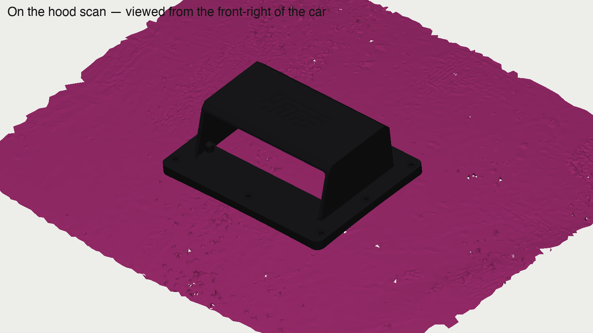

# Probe GT hood scoop — #42

A bolt-on, 3D-printed fresh-air hood scoop for the 4OGS Ford Probe GT race car. It sits over a 199 x 75 mm opening cut in the hood ahead of the cone filter, feeds outside air down through a lined throat, and a short flap under the hood turns that air toward the filter. Black ASA, purple accents, 4OGS wordmark inlaid on the roof. Every part prints without supports.



**Status: prototype, waiting for on-car checks.** The opening position, the hood's double-skin depth and the cone position all come from a 3D scan and a nozzle test, not from a tape measure. The first job is to print the template and confirm them. See the [build guide](docs/BUILD_GUIDE.md).

## What's here

| Folder | Contents |
|---|---|
| [`docs/BUILD_GUIDE.md`](docs/BUILD_GUIDE.md) | Step-by-step instructions with pictures. Start here. |
| [`docs/BOM.md`](docs/BOM.md) | Parts, hardware and filament. Only four things to buy. |
| [`docs/DESIGN.md`](docs/DESIGN.md) | How the design works, the coordinate frame, every parameter. |
| [`docs/DECISIONS.md`](docs/DECISIONS.md) | Why it is the way it is, newest first. |
| [`validation/`](validation/README.md) | What was checked against the scan and how the parts print. |
| [`stl/`](stl) | Printable parts, ready to slice. Local frame, millimetres. |
| [`step/`](step) | STEP export of the whole system for other CAD. |
| [`cad/`](cad) | Onshape FeatureScript (design master), the Python mirror that rebuilds the STLs without Onshape, and the validation and figure scripts. |
| [`reference/`](reference) | The scan meshes, the photos and the original design brief this was built from. |

## Parts at a glance


| Part | Material | Print | What it does |
|---|---|---|---|
| T  template | PLA | flat | Transfers the opening and the 8 bolt holes to the hood. Print this first. |
| A1 flange plate | black ASA | top face down | Matches the hood curve, carries the 8 M6 bolts, locates the cowl. |
| A2 cowl | black ASA (+ purple logo) | roof down | The slab with the raked mouth. Screws to the plate on the bench with 6 M4. |
| S  throat sleeve | purple ASA | standing | Lines the cut through both hood skins. |
| R  rain cap | purple ASA | flange down | Snap-in blank for rain or storage. |
| C  guide | purple ASA | bracket down | U-bracket plus 45° flap under the hood, aims air at the cone. |
| D  strips | 25 x 3 aluminium flat bar | cut and drill | Load-spreading backing for the 8 bolts. |

Hardware: 8 x M6x50, 6 x M4 self-tapping, nylocs, washers, Ø10 tube for limiters and spacers, 2 mm foam gasket tape.

## CAD

Design master: [Onshape document](https://cad.onshape.com/documents/b03b5bf08a93c5df66f722d9/w/0932d1534808bff872171f8f) (custom feature "Probe hood scoop system" in the "Probe scoop FeatureScript" tab; every dimension is a parameter). The scan meshes are in the same document in the scan frame, and the assembly "Scoop on car" shows the scoop on the hood.

To rebuild the STLs without Onshape:

```bash
pip install numpy trimesh shapely manifold3d networkx
python3 cad/local_build.py                      # writes stl/
python3 cad/local_build.py --set roofTop=76     # any parameter from DESIGN.md
```

The mirror was checked against the Onshape export of the same parameters: identical to within 0.13 mm.
