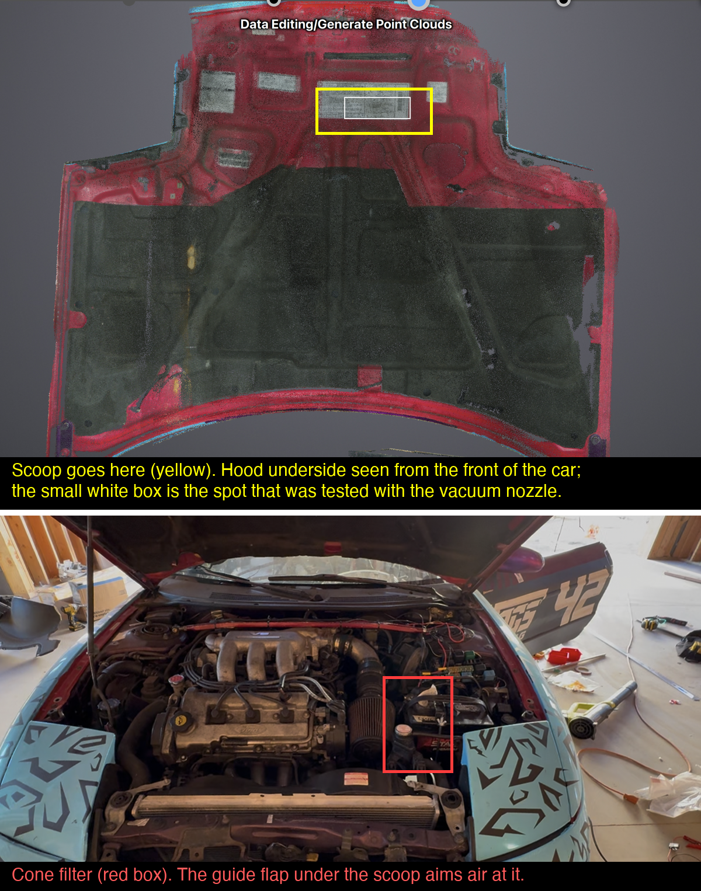
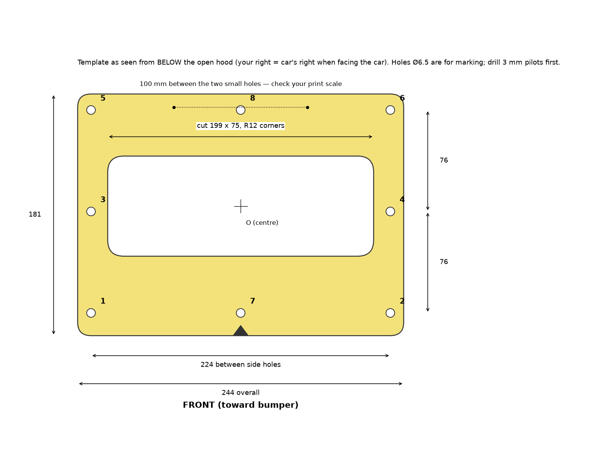
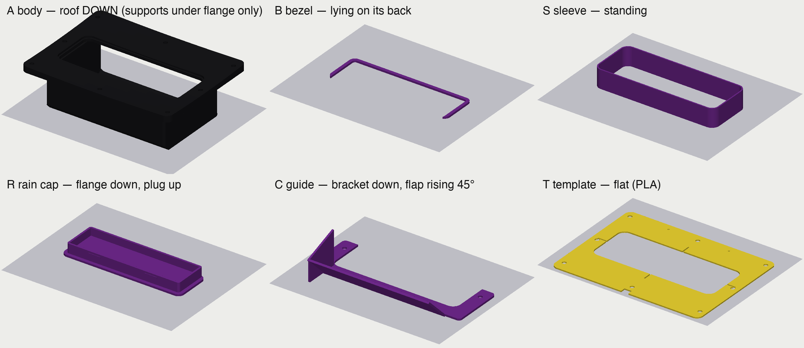
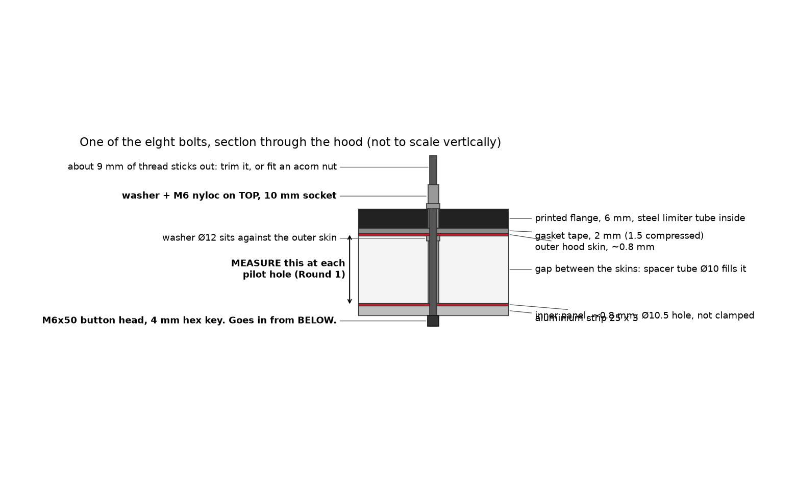
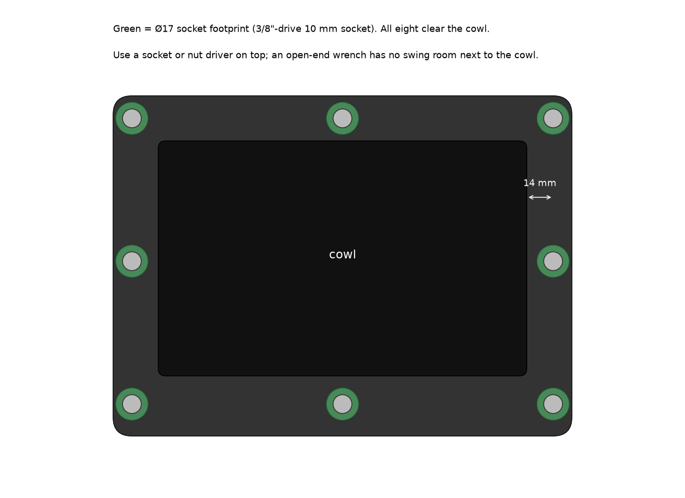

# Build guide

This is written for whoever is at the car. Everything is in millimetres. "Front" always means toward the bumper, and "right" means your right when you stand at the bumper facing the car.

There are two rounds. **Round 1** is the template and a few measurements. Send those back and the design gets updated (bolt lengths and tube lengths depend on them). **Round 2** is the actual cut and fit.

---

## Round 1 — check the spot (an hour, no cutting)

### What you need
- The template, printed: `stl/T_fit_check_template.stl`, PLA, flat on the bed, 0.2 mm layers. Check it after printing: the two small holes near the back edge must be exactly 100 mm apart.
- Masking tape, a marker, a 3 mm drill, a depth gauge or a stiff piece of wire and a ruler, a phone for photos.

### 1. Put the template on the hood
Hood up. Hold the template against the **underside** of the hood on the bare metal patch with the emissions stickers, to the right of centre. The small triangle notch points to the **front** (bumper). Line the centre cross up with the spot that was tested with the vacuum nozzle.

Look for:
- The whole template lies on flat metal. No hole should land on a raised rib or on the black insulation pad. If one does, slide the template a little and tell us how far.
- Nothing above the template inside the engine bay would be hit by a box 65 mm tall sitting where the template is. If you have a 65 mm block, set it on the patch and close the hood slowly. It should close with room to spare.

Tape the template down. Mark through all 8 holes and draw around the inside of the big opening. Write the hole numbers next to the marks (they are on the drawing above).

### 2. Pick two landmarks
Pick two things on the hood underside that will not move, for example a weld nut and a rib corner. Call them A and B. Measure A to B, A to the template centre, and B to the template centre. Take a photo showing A, B and the template. This lets us put the template back in exactly the same place later.

### 3. Drill eight 3 mm pilot holes
Through each of the 8 marks, drill straight through the hood. You will go through two layers of metal: the inner panel and then the outer skin. Go slowly at the end so the drill does not wander on the paint.

### 4. Measure the depth at each hole
At each pilot hole, measure from the **top of the paint** down to the **underside of the inner panel**. A depth gauge, or a wire with a hook bent on the end, pushed through from the top and pulled back until it catches. Write all eight down with the hole numbers. The scan suggests they vary between about 12 and 38 mm; that is expected.

Also note the thickness of the outer skin if you can see it at a hole (probably about 0.8 mm).

### 5. Send back
- Photo of the taped template on the hood, with A and B visible.
- The A–B, A–centre, B–centre distances.
- The eight depths.
- Anything that looked wrong.

That is the end of Round 1. The design will be updated with the real depths, and the two bolts that might need to be longer get decided.

---

## Round 2 — cut, make, print, fit

### Parts to have ready
- Everything in [BOM.md](BOM.md). Print the body in black ASA roof-down with supports only under the flange ring; everything else per the picture below. ASA wants a closed printer door, a hot bed and a brim on the body.

### 6. Cut the opening
Mask the paint. From outside, drill a 3 mm hole at the template centre first and check the outline looks right against the hood from above. Then cut the outer skin to **199 x 75 mm with 12 mm radius corners**: a hole saw or step drill at the four corners, a jigsaw with a fine metal blade between them. Stay 1 mm inside the line and file to size. Cut the inner panel to the same size from below. Deburr everything and prime the bare metal.

### 7. Open the bolt holes
Outer skin: **6.5 mm**. Inner panel: **10.5 mm** (a step drill is easiest). The inner panel gets the bigger hole on purpose: a spacer tube passes through it and bears on the outer skin, so the inner panel is never squeezed.

### 8. Make the metal bits
Flat bar 25 x 3: two long pieces, 249 mm, each with three 6.5 mm holes. The easy way to mark them is to lay the template on the bar and mark through holes 1-7-2 for one strip and 5-8-6 for the other. Two short pieces, 110 mm, with one hole in the middle. Round the ends and deburr.

Tube Ø10: eight **limiters, 6.0 mm long** (they must all be the same length, square ends). Eight **spacers**, one per hole, each cut to that hole's measured depth minus 2.4 mm (that is minus the skin and a washer). Label them 1 to 8.

### 9. Bolt it on

1. Stick the foam gasket tape around the underside of the flange as one unbroken loop near the edge, and a second loop around the throat.
2. Push the eight limiter tubes into the flange holes. Set the body on the hood over the opening.
3. From below, for each hole: slide a washer onto the spacer tube, push the tube up through the big inner-panel hole until the washer touches the outer skin, hold a strip under it, and push an **M6x50 up from below** through strip, tube, skin and flange. On top: washer and nyloc, finger tight. Long strips front and rear, short strips on the two middle bolts.
4. Tighten all eight in a criss-cross, finishing at **5 to 6 N·m** with a 10 mm socket. The steel tubes take the load; you cannot crush the plastic.
5. Push the **sleeve** up from below into the throat until it seats. Run a bead of RTV where it passes the inner panel.
6. Glue the **bezel** into the recess around the mouth with three dabs of CA, flush with the face. Try the **rain cap**.
7. **Guide**: take the two middle bolts out, slide the bracket's arms between the strips and the bolt heads, put the bolts back and torque. Press a lump of modelling clay onto the flap tip, close the hood fully, open it and look at the clay: you want at least 25 mm to the cone and 15 mm to any hose or wire.
8. Trim the thread sticking up above the nuts (cover the paint), or fit acorn nuts over them.

### 10. Check it works
- Close the hood slowly three times, then normally. Nothing should touch.
- After a hot run: look for sag in the body, lifting of the bezel, droop in the flap.
- Hose test with the cap off: water should run out of the mouth and drip off the flap in front of the cone, not onto it. Cap on: dry throat.
- Re-torque the eight nuts after the first session.

## If something does not fit
Every dimension is a parameter. Tell us what interfered and by how much, and a new part comes back the same day.
