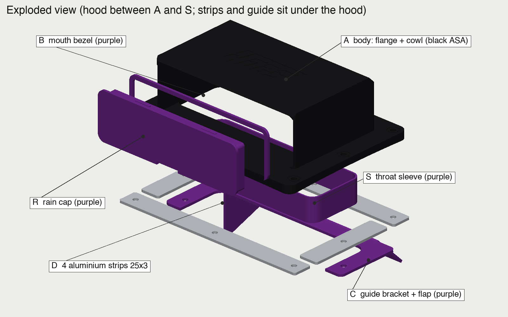

# Design notes

## Intent
A supplemental fresh-air feed, not a sealed cold-air intake. The mouth faces forward on the hood's downslope, 72 mm up, well clear of the boundary layer. It captures far more air than the engine draws, so most of it spills into the bay and keeps the area around the cone filter slightly pressurised with outside air. A sealed airbox can bolt to the same opening and hole pattern later; the throat and bolt pattern were sized for that.

## Coordinate frame
Everything in the STLs is in a local frame on the hood at the opening centre O:
- **x** across the car, positive toward your right when standing at the bumper facing the car,
- **y** rearward toward the windshield,
- **z** out of the hood, zero at the outer skin surface at O. The flange underside follows the measured hood curvature (a quadratic fitted to the scan: 8.8° downslope toward the front, about 5 mm of sag at the flange corners).

In the scan's frame O is at about X 110, Y −340, Z 104. That came from the emissions-label neighbourhood the owner tested with a vacuum nozzle, not from a measurement, which is why the template exists.

## Parts and how they go together

- **A body**: hood-matched flange (244 x 181 x 6) and slab cowl (196 x 125, roof at 72) in one piece. Small 4 mm brow chamfer, 10 mm tail chamfer, 4 mm corner radii. Mouth 186 x 55.5 (103 cm²) with a 3 mm recess for the bezel. 4OGS wordmark debossed 0.6 mm on the roof. Eight Ø6.5 holes, each with a 0.6 mm debossed ring. A 1.5 mm seat on the underside locates the sleeve.
- **S throat sleeve**: 199 x 75 outside, 2 mm wall, lines the cut through both skins so the cavity stays dry and the edges are hidden. Pushed up from below, sealed with RTV.
- **B bezel**: 5 mm wide, 3 mm thick purple frame, flush in the recess, open at the sill.
- **R rain cap**: flange matching the bezel outline, hollow 15 mm plug with 0.3 mm clearance, two 0.6 mm snap bumps, finger notch that doubles as a drain.
- **C guide**: U-bracket (two arms plus a rear bar) clamped under the side strips by the two middle bolts, with a 200 wide flap at 45° reaching 50 mm and a 55 mm inboard cheek that pushes air outboard toward the cone. Provisional until the clay test; reach, angle and cheek are parameters.
- **D strips**: four pieces of 25 x 3 aluminium flat bar under the inner panel. Two across (front and rear rows, 3 holes) and two short (middle bolts).
- **Fasteners**: 8 x M6x50 head-down, steel limiter tubes through the flange, steel spacer tubes across the inter-skin gap passing through Ø10.5 holes in the inner panel. The clamp path is head → strip → tube → outer skin → gasket → flange → nut, so no plastic carries preload and the inner panel is not pulled toward the outer skin.

## Parameters
All in the Onshape feature and in `cad/local_build.py` (same names, mm).

| Group | Parameter | Default | Meaning |
|---|---|---|---|
| Opening | cutW, cutL, cutR | 195, 71, 10 | clear throat; hood cut = this + 2 x sleeveWall |
| | sleeveWall | 2 | |
| Hood stack | skinT, innerGap, innerT, gasketT | 0.8, 21, 0.8, 1.5 | **measure** innerGap at the pilot holes |
| Flange | baseW, baseFront, baseRear, baseR, baseT | 244, 97, 84, 10, 6 | |
| Cowl | bodyW, bodyFront, bodyRear, roofTop, wall, bodyR | 196, 65, 60, 72, 3, 4 | |
| | chamferF, chamferR | 4, 10 | |
| Mouth | mouthW, mouthR, lipR, bezelW | 186, 4, 2.5, 5 | mouth height = roofTop − chamferF − bezelW − gasketT − baseT |
| Bolts | boltX, boltYF, boltYM, boltYR | 112, 80, −4, 72 | rows at y = −80, −4, +72; x = ±112 plus centre front/rear |
| | holeD, boltL, backingT | 6.5, 50, 3 | |
| Guide | guideW, guideReach, guideAngle, cheekH, guideT | 200, 50, 45, 55, 3 | physical-fit parameters |

## Decisions worth knowing
- **One-piece body.** An earlier two-piece version (base plus cowl) had no fastener joining them and the base could not print flat. The one-piece prints roof-down with supports only under the flange ring.
- **Head-down bolts.** With nuts underneath, the bolt ends came within 2 mm of engine-bay structure at the front-right corner, where the scan shows only about 43 mm under the skin. Heads down cut under-hood protrusion by 10 mm. Nuts on top also read well with the design language.
- **Guide clamped by the middle bolts.** Replaced a hanger ring with rivnuts and bosses; removes four purchases and a tool. Removing the guide means loosening two nuts.
- **Flat bar instead of a sheet frame.** Hardware-store material, hacksaw and drill.
- **Cowl 196 wide.** Narrowed from 210 so a 3/8"-drive 10 mm socket clears the cowl wall on the side nuts (14 mm centre-to-wall, 5.5 mm margin).
- **Mouth 103 cm².** Above the brief's 100 minimum, below its 120 preferred. Raising roofTop to 76 gives 120.
- **Materials.** ASA on the hood, PLA for the template only. Compression-limiter tubes keep plastic out of the preload path so creep is not a concern.

## Design language
Teenage Engineering slab: flat top, crisp small chamfers, uniform radii, exposed fasteners on a regular pitch, two-colour blocking (black body, purple bezel, sleeve, cap and guide), debossed wordmark. The car's livery is light blue and black with purple panels, hence purple.

## What is not proven
No CFD, no load test, no hood-closing sweep simulation. The scan's hood-underside registration is provisional (median 4 mm lateral, local conflicts) and the cone is not in the scan. The build guide's Round 1 exists to replace those assumptions with measurements.
